# Greengage Reusable Docker Retag and Upload Workflow

This workflow retags and uploads Docker images for the Greengage project to the GitHub Container Registry (GHCR) and optionally DockerHub. It is designed to be called from a parent CI pipeline, enabling users to manage Docker image tags with flexible version and operating system configurations.

## Actual version `v16`

- `greengagedb/greengage-ci/.github/workflows/greengage-reusable-upload.yml@v16`

## Purpose

The workflow performs the following tasks using a Docker image built for the given Greengage version and target operating system:

- Retag Docker images based on the event type (tag push or branch push)
- Push images to GHCR (mandatory)
- Push images to DockerHub (mandatory for upstream, optional for forks)

## Algorithm

```mermaid
flowchart TD
    Start([🚀 Start Workflow]) --> LoginGHCR[Login to GHCR<br/>MANDATORY]
    LoginGHCR --> CheckGHCR{Login<br/>successful?}
    CheckGHCR -->|NO| FailGHCR[❌ FAIL Pipeline<br/>GHCR is required]
    CheckGHCR -->|YES| LoginDHCR[Attempt login to DockerHub<br/>continue-on-error for forks]
    
    LoginDHCR --> CheckRepo{Repository<br/>is upstream?<br/>greengagedb/greengage}
    
    CheckRepo -->|YES upstream| CheckDHCRUpstream{DockerHub<br/>login success?}
    CheckDHCRUpstream -->|NO| FailDHCR[❌ FAIL Pipeline<br/>DHCR mandatory for upstream]
    CheckDHCRUpstream -->|YES| SetDHCR[DHCR_LOGGED_IN = true]
    
    CheckRepo -->|NO fork| CheckDHCRFork{DockerHub<br/>login success?}
    CheckDHCRFork -->|YES| SetDHCR
    CheckDHCRFork -->|NO| UnsetDHCR[DHCR_LOGGED_IN = false<br/>Continue anyway]
    
    SetDHCR --> LoadImage[Load image from GHCR:<br/>IMAGE:SHA]
    UnsetDHCR --> LoadImage
    
    LoadImage --> CheckPushType{Event<br/>type?}
    
    %% TAG PUSH BRANCH
    CheckPushType -->|refs/tags/*<br/>TAG PUSH| GetTag[Get sanitized tag:<br/>TAG = git describe]
    GetTag --> CheckSemantic{Is latest<br/>semantic tag<br/>for version?}
    
    CheckSemantic -->|YES| SetLatest[IS_LATEST = true]
    CheckSemantic -->|NO| SetNotLatest[IS_LATEST = false]
    
    SetLatest --> GHCRTagPush[🔵 GHCR PUSH:<br/>TAG]
    SetNotLatest --> GHCRTagPush
    
    GHCRTagPush --> CheckDHCRTag{DHCR_LOGGED_IN?}
    
    CheckDHCRTag -->|true| DHCRTagPush[🔴 DHCR PUSH:<br/>TAG]
    CheckDHCRTag -->|false| SkipDHCRTag[⊘ Skip DHCR]
    
    DHCRTagPush --> CheckLatest{IS_LATEST?}
    CheckLatest -->|true| DHCRLatestPush[🔴 DHCR PUSH:<br/>latest]
    CheckLatest -->|false| SkipLatest[⊘ Skip latest]
    
    DHCRLatestPush --> End
    SkipLatest --> End
    SkipDHCRTag --> End
    
    %% BRANCH PUSH BRANCH
    CheckPushType -->|refs/heads/*<br/>BRANCH PUSH| GHCRLatestPush[🔵 GHCR PUSH:<br/>latest]
    
    GHCRLatestPush --> CheckDHCRBranch{DHCR_LOGGED_IN?}
    
    CheckDHCRBranch -->|true| DHCRTestingPush[🔴 DHCR PUSH:<br/>testing]
    CheckDHCRBranch -->|false| SkipDHCRBranch[⊘ Skip DHCR]
    
    DHCRTestingPush --> End
    SkipDHCRBranch --> End
    
    FailGHCR --> EndFail([❌ Workflow Failed])
    FailDHCR --> EndFail
    End([✓ Workflow Complete])
    
    %% Styling
    classDef dhcrStyle fill:#ff6b6b,stroke:#c0392b,stroke-width:2px,color:#fff
    classDef ghcrStyle fill:#4ecdc4,stroke:#1abc9c,stroke-width:2px,color:#fff
    classDef checkStyle fill:#95e1d3,stroke:#16a085,stroke-width:2px,color:#000
    classDef skipStyle fill:#95a5a6,stroke:#7f8c8d,stroke-width:2px,color:#fff
    classDef processStyle fill:#f9ca24,stroke:#f39c12,stroke-width:2px,color:#000
    classDef startStyle fill:#667eea,stroke:#764ba2,stroke-width:3px,color:#fff
    classDef failStyle fill:#e74c3c,stroke:#c0392b,stroke-width:3px,color:#fff
    classDef loginStyle fill:#a29bfe,stroke:#6c5ce7,stroke-width:2px,color:#fff
    
    class DHCRTagPush,DHCRLatestPush,DHCRTestingPush dhcrStyle
    class GHCRTagPush,GHCRLatestPush ghcrStyle
    class CheckGHCR,CheckRepo,CheckDHCRUpstream,CheckDHCRFork,CheckPushType,CheckSemantic,CheckDHCRTag,CheckDHCRBranch,CheckLatest checkStyle
    class SkipDHCRTag,SkipDHCRBranch,SkipLatest skipStyle
    class GetTag,SetLatest,SetNotLatest,SetDHCR,UnsetDHCR,LoadImage processStyle
    class Start,End startStyle
    class FailGHCR,FailDHCR,EndFail failStyle
    class LoginGHCR,LoginDHCR loginStyle
```



### Detailed Algorithm Description

1. **Authentication Phase**:
   - **GHCR Login**: Always mandatory. Workflow fails if login is unsuccessful.
   - **DockerHub Login**:
     - Always attempts to login (no `if` condition)
     - Empty or invalid credentials cause the login action to fail
     - For `greengagedb/greengage` (upstream): Login failure stops the workflow (`continue-on-error: false`)
     - For other repositories (forks): Login failure is allowed, workflow continues (`continue-on-error: true`)

2. **Input Image**:
   - The workflow expects an existing Docker image in GHCR with the format:

     ```
     ghcr.io/<repo>/ggdb<version>_<target_os><target_os_version>:<sha>
     ```

   - Where:
     - `<repo>` = repository name (`${{ github.repository }}`)
     - `<version>` = Greengage version (e.g., `6` or `7`)
     - `<target_os>` = target OS (currently `ubuntu`)
     - `<target_os_version>` = optional OS version (preserved for compatibility, currently unused)
     - `<sha>` = full commit SHA (`${{ github.sha }}`)

3. **Tag Assignment and Push Logic**:

   **For TAG PUSH events** (when `github.ref` matches `refs/tags/*`):

   - Extract and sanitize tag: `TAG = git describe --tags --abbrev=0 | sed 's/\//_/g'`
   - Check if this is the latest semantic tag for the version (pattern: `^<version>\.[0-9]+\.[0-9]+$`)
   - **GHCR** (always):
     - Tag image with `TAG`
     - Push to GHCR
   - **DockerHub** (if logged in):
     - Tag image with `TAG`
     - Push to DockerHub
     - If this is the latest semantic tag:
       - Also tag as `latest`
       - Push `latest` to DockerHub

   Example for tag `6.29.2` (latest semantic tag for 6.x):

   ```
   GHCR:  ghcr.io/greengagedb/greengage/ggdb6_ubuntu:6.29.2  ✓
   DHCR:  greengagedb/ggdb6_ubuntu:6.29.2                  ✓
   DHCR:  greengagedb/ggdb6_ubuntu:latest                  ✓ (because latest)
   ```

   Example for tag `6.28.0` (NOT latest, 6.29.2 exists):

   ```
   GHCR:  ghcr.io/greengagedb/greengage/ggdb6_ubuntu:6.28.0  ✓
   DHCR:  greengagedb/ggdb6_ubuntu:6.28.0                  ✓
   DHCR:  greengagedb/ggdb6_ubuntu:latest                  ✗ (6.29.2 is latest)
   ```

   **For BRANCH PUSH events** (for example, push to `main` or `7.x` after PR merge):

   - **GHCR** (always):
     - Tag image as `latest`
     - Push to GHCR
   - **DockerHub** (if logged in):
     - Tag image as `testing`
     - Push to DockerHub

   Example for push to `main` branch:

   ```
   GHCR:  ghcr.io/greengagedb/greengage/ggdb6_ubuntu:latest   ✓ (dev build)
   DHCR:  greengagedb/ggdb6_ubuntu:testing                  ✓ (dev build)
   ```

## Tag Meaning by Registry

| Tag | GHCR (GitHub) | DockerHub |
|-----|---------------|-----------|
| `X.Y.Z` | Specific release version | Specific release version |
| `latest` | **Development build**<br/>Last push to main branch | **Stable release**<br/>Latest semantic version tag |
| `testing` | ❌ Not used | **Development build**<br/>Last push to main branch |
| `<sha>` | Base image (always present) | ❌ Not pushed |

### Why This Design?

- **GHCR** is the primary working registry and stores all builds by SHA
- **GHCR `latest`** points to the newest development code for internal development
- **DockerHub `latest`** points to the most recent stable release for public consumption
- **DockerHub `testing`** clearly marks unstable builds for users who want bleeding-edge features
- This separation ensures public users get stable releases by default while developers work with the latest code

## Usage

To integrate this workflow into your pipeline:

1. Add a job in your parent workflow that calls this reusable workflow
2. Provide the required and optional inputs as described below
3. Ensure the necessary permissions and secrets are configured

### Inputs

| Name                | Description                                      | Required | Type   | Default |
|---------------------|--------------------------------------------------|----------|--------|---------|
| `version`           | Version derived from tag (e.g., `6` or `7`)      | Yes      | String | -       |
| `target_os`         | Target operating system (currently `ubuntu`)     | Yes      | String | -       |
| `target_os_version` | Target OS version (preserved for compatibility)  | No       | String | `''`    |
| `python3`           | Python3 build argument                           | No       | String | `''`    |

**Note**: `target_os_version` is preserved for backward compatibility and future parameterization but is currently unused in the implementation.

### Secrets

| Name                | Description                         | Required |
|---------------------|-------------------------------------|----------|
| `ghcr_token`        | GitHub token for GHCR access        | **Yes** (mandatory) |
| `DOCKERHUB_USERNAME`| DockerHub username for authentication | **Conditional** * |
| `DOCKERHUB_TOKEN`   | DockerHub token for authentication  | **Conditional** * |

**\* DockerHub secrets requirements:**

- **For `greengagedb/greengage`**: Both secrets are **mandatory**. Workflow will fail if either is missing/empty or login fails.
- **For other repositories**: Both secrets are **optional**. If missing, empty, or login fails, workflow continues successfully without DockerHub operations.

### Requirements

- **Permissions**:
  - `contents: read` - to access repository contents
  - `packages: write` - to push images to GHCR
- **Source Image**: A Docker image must exist in GHCR with the format:

  ```
  ghcr.io/<repo>/ggdb<version>_<target_os><target_os_version>:<sha>
  ```

- **Git History**: Full git history is fetched to resolve tags correctly

### Example: Single Job

```yaml
jobs:
  upload:
    permissions:
      contents: read  # Required for repository access
      packages: write # Required for GHCR push
    uses: greengagedb/greengage-ci/.github/workflows/greengage-reusable-upload.yml@v16
    with:
      version: 6
      target_os: ubuntu
    secrets:
      ghcr_token: ${{ secrets.GITHUB_TOKEN }}
      DOCKERHUB_TOKEN: ${{ secrets.DOCKERHUB_TOKEN }}
      DOCKERHUB_USERNAME: ${{ secrets.DOCKERHUB_USERNAME }}
```

### Example: Matrix Job for Multiple Versions

```yaml
jobs:
  upload:
    if: github.event_name == 'push' # For push or tags
    needs: build                    # after build
    strategy:
      fail-fast: true
      matrix:
        target_os: [ubuntu]
    permissions:
      contents: read  # Explicit for default behavior
      packages: write # Required for GHCR access
    uses: greengagedb/greengage-ci/.github/workflows/greengage-reusable-upload.yml@v16
    with:
      version: 7
      target_os: ${{ matrix.target_os }}
    secrets:
      ghcr_token: ${{ secrets.GITHUB_TOKEN }}
      DOCKERHUB_TOKEN: ${{ secrets.DOCKERHUB_TOKEN }}
      DOCKERHUB_USERNAME: ${{ secrets.DOCKERHUB_USERNAME }}
```

## Behavior Examples

### Scenario 1: Upstream Release Tag (greengagedb/greengage)

**Event**: Push tag `6.29.2` (latest semantic tag for 6.x)

**Requirements**: GHCR login ✓, DockerHub credentials ✓ (mandatory)

**Results**:

```
✓ GHCR:  ghcr.io/greengagedb/greengage/ggdb6_ubuntu:6.29.2
✓ DHCR:  greengagedb/ggdb6_ubuntu:6.29.2
✓ DHCR:  greengagedb/ggdb6_ubuntu:latest
```

### Scenario 2: Upstream Hotfix Tag (greengagedb/greengage)

**Event**: Push tag `6.28.5` (NOT latest, 6.29.2 exists)

**Requirements**: GHCR login ✓, DockerHub credentials ✓ (mandatory)

**Results**:

```
✓ GHCR:  ghcr.io/greengagedb/greengage/ggdb6_ubuntu:6.28.5
✓ DHCR:  greengagedb/ggdb6_ubuntu:6.28.5
✗ DHCR:  greengagedb/ggdb6_ubuntu:latest (6.29.2 remains latest)
```

### Scenario 3: Upstream Development Push (greengagedb/greengage)

**Event**: Push to `main` branch (6.x development)

**Requirements**: GHCR login ✓, DockerHub credentials ✓ (mandatory)

**Results**:

```
✓ GHCR:  ghcr.io/greengagedb/greengage/ggdb6_ubuntu:latest (dev)
✓ DHCR:  greengagedb/ggdb6_ubuntu:testing (dev)
```

### Scenario 4: Upstream 7.x Release Tag (greengagedb/greengage)

**Event**: Push tag `7.4.1` from `7.x` branch (latest for 7.x)

**Requirements**: GHCR login ✓, DockerHub credentials ✓ (mandatory)

**Results**:

```
✓ GHCR:  ghcr.io/greengagedb/greengage/ggdb7_ubuntu:7.4.1
✓ DHCR:  greengagedb/ggdb7_ubuntu:7.4.1
✓ DHCR:  greengagedb/ggdb7_ubuntu:latest (latest for 7.x line)
```

**Note**: Each major version (`6.x` and `7.x`) maintains its own `latest` tag in DockerHub.

### Scenario 5: Fork Release Tag (user/greengage-fork)

**Event**: Push tag `6.30.0`

**Requirements**: GHCR login ✓, DockerHub credentials ✓ (optional)

**Results**:

```
✓ GHCR:  ghcr.io/user/greengage-fork/ggdb6_ubuntu:6.30.0
✓ DHCR:  forkuser/ggdb6_ubuntu:6.30.0
✓ DHCR:  forkuser/ggdb6_ubuntu:latest
```

### Scenario 6: Fork Without DockerHub (user/greengage-fork)

**Event**: Push tag `6.30.0`

**Requirements**: GHCR login ✓, DockerHub credentials ✗ (optional - not provided)

**Results**:

```
✓ GHCR:  ghcr.io/user/greengage-fork/ggdb6_ubuntu:6.30.0
⊘ DHCR:  Skipped (login failed, allowed for forks)
```

### Scenario 7: Upstream Without DockerHub (ERROR)

**Event**: Push tag `6.29.3` to `greengagedb/greengage`

**Requirements**: GHCR login ✓, DockerHub credentials ✗ (mandatory - missing)

**Results**:

```
❌ WORKFLOW FAILS
Reason: DockerHub login failed (credentials missing/invalid)
Error: docker/login-action fails due to missing username/password
```

## Failure Conditions

The workflow will fail under the following conditions:

| Condition | Upstream (greengagedb/greengage) | Forks |
|-----------|----------------------------------|-------|
| GHCR login fails | ❌ Fail | ❌ Fail |
| DockerHub credentials missing | ❌ Fail | ✓ Continue |
| DockerHub credentials invalid | ❌ Fail | ✓ Continue |
| DockerHub login fails (other) | ❌ Fail | ✓ Continue |
| Source image not found in GHCR | ❌ Fail | ❌ Fail |
| Invalid tag format | ❌ Fail | ❌ Fail |

## Troubleshooting

### Workflow fails with "GHCR login failed"

- Ensure `secrets.GITHUB_TOKEN` has `packages: write` permission
- Verify the token is being passed correctly as `ghcr_token`

### Workflow fails with DockerHub login error (upstream only)

- For `greengagedb/greengage`, both `DOCKERHUB_USERNAME` and `DOCKERHUB_TOKEN` must be:
  - Configured in repository secrets
  - Non-empty
  - Valid credentials
- Verify the secrets are configured in the repository settings

### Image not found in GHCR

- Ensure the build job completed successfully before calling this workflow
- Verify the image name format matches expectations
- Check that the image was pushed to GHCR with the correct SHA tag

### Tag shows as "unknown"

- This occurs when `git describe` cannot find any tags
- Ensure tags are fetched: `fetch-depth: 0` in checkout action
- Verify git tags exist in the repository

### Fork continues without DockerHub (not an error)

- This is expected behavior for non-upstream repositories
- Forks can operate without DockerHub credentials
- Only GHCR operations are mandatory for forks
